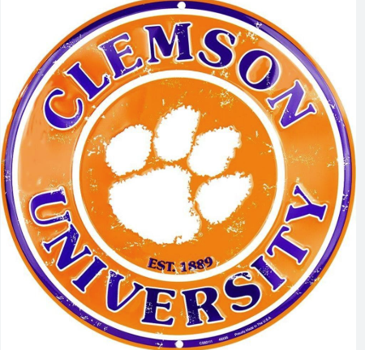
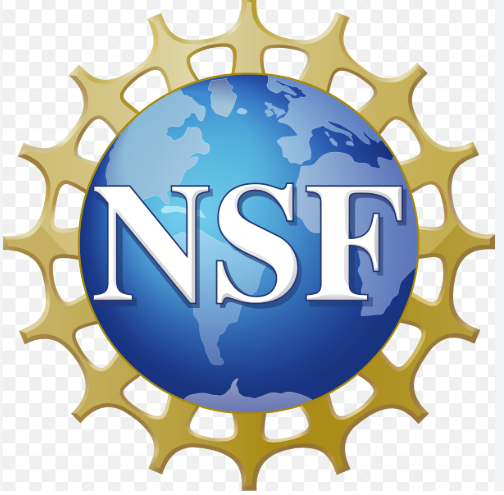

# 🧾 Funding

🔗 [Visit source page](https://orcid.org/0000-0002-7396-2572)

---

### 🎓 Doctoral Dissertation Completion Award
- **Type:** Award  
- **Institution:** Clemson University  
- **Location:** Clemson, South Carolina, US  
- **Recipient:** Amirhossein Nazeri  
- **Date:** *Not specified*

---

### 🔐 Securing Machine Learning Against Adversarial Attacks for Connected and Autonomous Vehicles
- **Type:** Grant  
- **Institution:** U.S. National Science Foundation  
- **Location:** Greenville, South Carolina, US  
- **Recipient:** Amirhossein Nazeri  
- **Date:** *Not Specified*  

---

### 🚗 Transfer of Technologies for Performance Degradation Prediction and Channel Switching in Vehicular Networks under Harsh Weather Conditions and Integration with State-of-the-Art Products
- **Type:** Grant  
- **Institution:** Center for Connected Multimodal Mobility  
- **Location:** Columbia, South Carolina, US  
- **Recipient:** Amirhossein Nazeri  
- **Date:** *Not specified*

---
