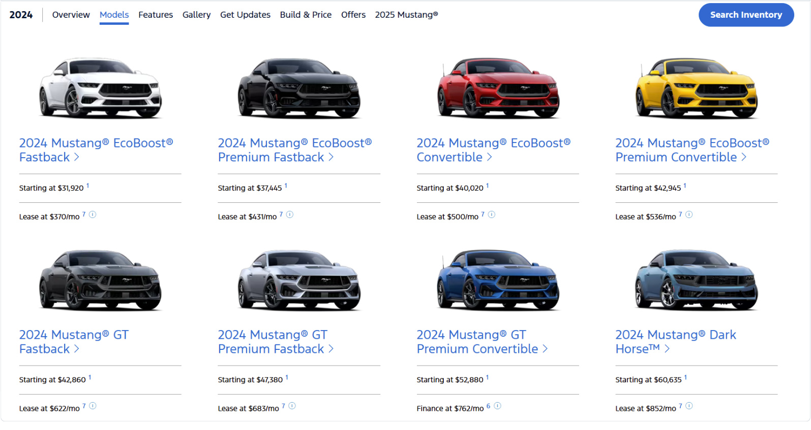
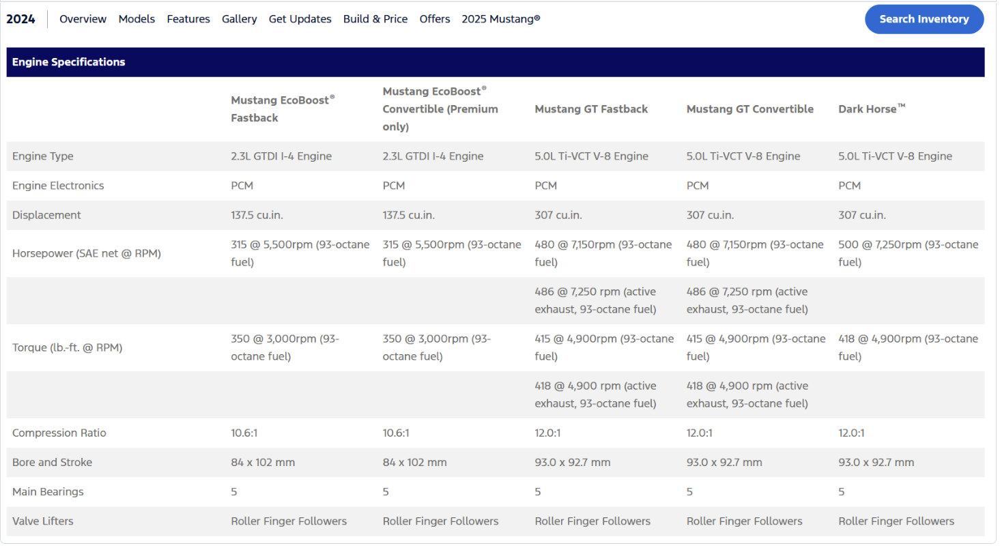

Build Your Own Custom Chatbot: This project is a custom chatbot application that answers user queries on technical specifications for Ford’s 2024 car and SUV models. The chatbot uses **Retrieval-Augmented Generation (RAG)**, combining data retrieval and AI-based language generation to provide precise, contextually relevant answers about Ford vehicle specifications.

## Table of Contents
- [Project Overview](#project-overview)
- [Features](#features)
- [Installation](#installation)
- [Usage](#usage)
- [File Structure](#file-structure)
- [Technical Details](#technical-details)
- [Future Improvements](#future-improvements)

## Project Overview
This chatbot scrapes technical specifications for various Ford 2024 car and SUV models from the Ford website, structures the data, and creates an efficient retrieval system for answering user questions. It leverages embeddings and FAISS (Facebook AI Similarity Search) to provide efficient similarity-based retrieval, alongside the OpenAI API to generate accurate, natural language responses.

## Data
Technical specifications for various Ford 2024 car and SUV models from the Ford website (example: Mustang 2024):

{: .align -center width="450px"}
{: .align -center width="450px"}


## Features
- **Data Scraping**: Scrapes tables of specifications from Ford’s website for each listed model.
- **Data Embedding**: Converts specifications into embeddings using SentenceTransformers.
- **Efficient Retrieval**: Uses FAISS to index and retrieve relevant rows based on similarity to the user's query.
- **Query Answering**: Generates responses using OpenAI's API, specifically tailored to respond based on Ford specifications.

## Installation
To get this project up and running locally, follow these steps:

1. **Clone the Repository**:
    ```bash
    git clone https://github.com/amirhnazerii/Ford-AI-Chatbot.git
    cd ford-2024-chatbot
    ```

2. **Install Required Packages**:
   Install dependencies from `requirements.txt`:
    ```bash
    pip install -r requirements.txt
    ```

3. **Set Up OpenAI API Key**:
   Set up your OpenAI API key as an environment variable:
   ```bash
   export OPENAI_API_KEY='your_openai_api_key_here'
   ```

## Usage
To run the chatbot application, execute the `main.py` file:

```bash
python main.py
```

After running, the chatbot will:
1. Scrape Ford 2024 model data from specified URLs.
2. Create embeddings and index them with FAISS for efficient querying.
3. Wait for user queries and return responses based on the specifications scraped.

### Example Query
The chatbot is designed to answer questions like:
- "What are the engine specifications for the 2024 Ford Expedition?"
- "Explain the safety features in Ford Bronco 2024."

## File Structure

```
PATH/
│
├── main.py                  # Main script to run the chatbot
├── data_scraper.py          # Scrapes and structures vehicle specification data
├── RAG.py                   # Embedding generation and retrieval system (RAG)
├── openai_chat.py           # OpenAI API interaction for response generation
├── requirements.txt         # List of required dependencies
└── README.md                # Project description and setup instructions
```

## Technical Details

- **Data Scraping**: The `data_scraper.py` script collects specifications tables from Ford’s product pages, organizes them into a structured format, and outputs data as a list of strings.

- **Embedding and Retrieval**:
  - **Embedding**: `RAG.py` uses `SentenceTransformer` to convert scraped data into embeddings.
  - **Indexing**: FAISS is used to index these embeddings, enabling fast similarity search.
  - **Query Matching**: Given a user query, the chatbot converts it to an embedding, retrieves the closest matches from the FAISS index, and sends this relevant information to OpenAI’s model.\
  Customer query: *What are the exterior dimensions of Ford bronco 2024?* \
  Retrived closest matches: 

  ```
  
  ["{'car model': '2024 Bronco® Sport Big Bend® SUV | Model Details & Specs | Ford.com', 'Exterior Dimensions': 'Length (in.)', 'Unnamed: 1': '172.7'}",
  "{'car model': '2024 Bronco® Sport Big Bend® SUV | Model Details & Specs | Ford.com', 'Exterior Dimensions': 'Vehicle height (without options) (1.5L / 2.0L) (in.)', 'Unnamed: 1': '70.2/71.4'}",
  "{'car model': '2024 Bronco® Sport Big Bend® SUV | Model Details & Specs | Ford.com', 'Interior Dimensions': 'Second row', 'Unnamed: 1': '53.4'}",
  "{'car model': '2024 Bronco® Sport Big Bend® SUV | Model Details & Specs | Ford.com', 'Interior Dimensions': 'First row (maximum)', 'Unnamed: 1': '42.4'}",
  "{'car model': '2024 Bronco® Sport Big Bend® SUV | Model Details & Specs | Ford.com', 'Exterior Dimensions': 'Vehicle width with mirrors folded (in.)', 'Unnamed: 1': '76.3'}",
  "{'car model': '2024 Bronco® Sport Big Bend® SUV | Model Details & Specs | Ford.com', 'Interior Dimensions': 'Second row', 'Unnamed: 1': '55.6'}",
  "{'car model': '2024 Bronco® Sport Big Bend® SUV | Model Details & Specs | Ford.com', 'Exterior Dimensions': 'Drive system', 'Unnamed: 1': '4 X 4'}",
  "{'car model': '2024 Bronco® Sport Big Bend® SUV | Model Details & Specs | Ford.com', 'Interior Dimensions': 'Second row', 'Unnamed: 1': '36.9'}",
  "{'car model': '2024 Bronco® Sport Big Bend® SUV | Model Details & Specs | Ford.com', 'Exterior Dimensions': 'Vehicle width without mirrors (in.)', 'Unnamed: 1': '74.3'}",
  "{'car model': '2024 Bronco® Sport Big Bend® SUV | Model Details & Specs | Ford.com', 'Exterior Dimensions': 'Vehicle width with mirrors (in.)', 'Unnamed: 1': '82.2'}"]
  
  ```
  
  

- **OpenAI Completion**: In `openai_chat.py`, the retrieved data and user query are formatted into a prompt. The OpenAI API generates a final response based on this prompt.

## Future Improvements:
- **Automated URL Updates**: Automatically update the URLs or add new Ford models.
- **Enhanced Query Handling**: Improve the retrieval system to handle complex or ambiguous queries more effectively.
- **Additional Model Training**: Fine-tune a custom model on Ford-specific terminology for even greater accuracy.

---
Disclaimer: This project is not associated with or endorsed by Ford Motor Company. Any use of Ford trademarks or copyrighted materials is intended for educational purposes only (e.g. Udacity Generative AI Course 3 Build Your Own Custom Chatbot).

[More Information](https://github.com/amirhnazerii/Ford-AI-Chatbot)