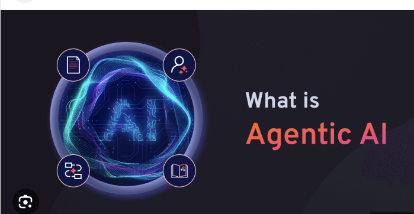

- 

As artificial intelligence continues to evolve, a new paradigm is beginning to take center stage: **Agentic AI**. This term refers to AI systems that are not just reactive or predictive, but capable of operating as autonomous agents—entities that can set goals, make decisions, and interact with their environment proactively. In contrast to traditional AI, which performs tasks when given explicit instructions, Agentic AI has the ability to take initiative, reason about its actions, and adapt to new challenges in real time.

## What is Agentic AI?

At its core, Agentic AI refers to AI systems that behave like *agents*—entities that perceive their environment, process information, and act upon that environment in order to achieve specific objectives. These systems are often designed to handle complex tasks with minimal human supervision. They can formulate plans, break them down into sub-goals, and revise their strategies based on feedback or changes in the environment.

For example, consider an AI-powered personal assistant that doesn’t just respond to your calendar requests, but actively reorganizes your schedule based on your priorities, predicts potential conflicts, reschedules meetings with others on your behalf, and even suggests downtime when it detects signs of burnout. This is the kind of proactive, goal-oriented intelligence Agentic AI aims to bring to real-world systems.

## Key Characteristics of Agentic AI

Agentic AI differs from traditional machine learning in several important ways:

- **Autonomy**: Agentic AI can act independently without constant external prompting. Once given a goal, it determines the best path to achieve it.
- **Goal-Oriented Behavior**: Rather than executing a single task, agentic systems aim to achieve higher-level goals and often define sub-goals to get there.
- **Adaptability**: These systems can adjust their behavior based on new information or unexpected situations, which is crucial for functioning in dynamic environments.
- **Reflection and Iteration**: Advanced Agentic AI systems may evaluate their own performance, reflect on past decisions, and iteratively improve over time—similar to how humans learn from experience.

## Applications in the Real World

The implications of Agentic AI are far-reaching. In **autonomous robotics**, for instance, robots can use agentic reasoning to navigate unfamiliar environments or complete multi-step tasks, such as cooking a meal or assembling a product. In **scientific research**, agentic systems can act as autonomous research assistants, formulating hypotheses, running simulations, and identifying promising directions for human scientists to explore.

In the field of **software development**, tools like GitHub Copilot are beginning to move toward agentic behavior—writing, refactoring, and even testing code with less intervention. In **education**, agentic tutoring systems could personalize learning paths for students, proactively offering explanations, practice problems, and motivation strategies based on individual progress.

## Challenges and Considerations

However, with greater autonomy comes greater responsibility. As we build more capable agentic systems, we must consider questions of **alignment**, **safety**, and **ethics**. How do we ensure that an autonomous agent's goals remain aligned with human values? What safeguards are in place if the agent misinterprets its objectives or makes decisions with unintended consequences?

Additionally, there's the issue of **accountability**. If an agentic AI system makes a decision that leads to harm or failure, who is responsible—the developer, the user, or the AI itself? These are complex questions that require not just technical solutions but interdisciplinary collaboration across law, philosophy, and public policy.

## The Road Ahead

Agentic AI represents a major leap in our pursuit of artificial general intelligence (AGI)—machines with the capacity to perform a wide range of intellectual tasks at or above human level. While we are still far from truly general AI, the agentic approach is a critical step toward systems that can understand context, make long-term plans, and interact with the world in meaningful ways.

At the same time, it's important to temper ambition with caution. Agentic systems are powerful tools, but like any tool, they require thoughtful design and ethical oversight. By combining technical innovation with responsible governance, we can ensure that agentic AI contributes positively to society.

---

**In Summary**, Agentic AI is more than just a buzzword—it's a new way of thinking about artificial intelligence. As we develop machines that can act with purpose, adapt with intelligence, and assist with intention, we edge closer to a world where AI is not just reactive but truly collaborative. The future isn't just about smarter machines—it's about machines that can think, reflect, and act with us.