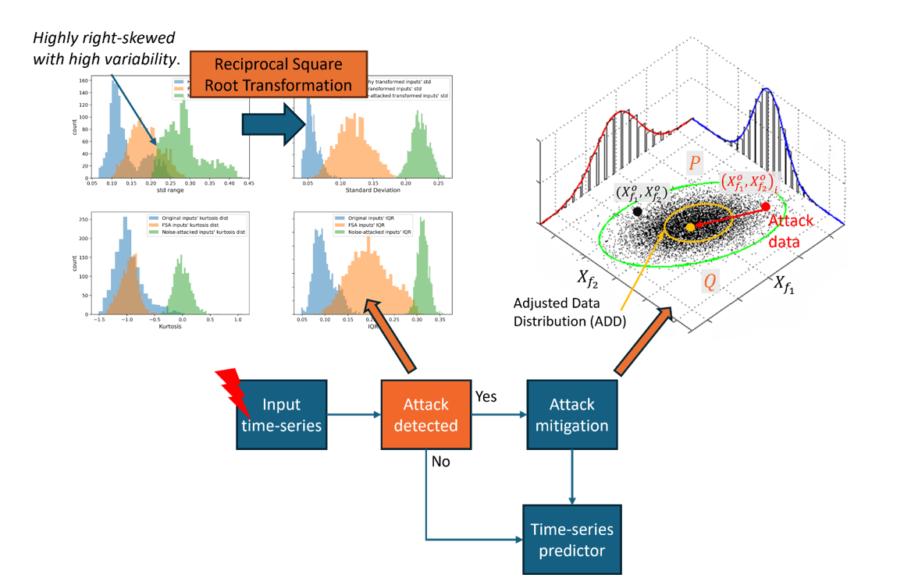

- This paper introduces a frequency-domain false data injection attack called Frequency Spectrum Attack (FSA) and explores its effects on load forecasting and the energy management system (EMS) in a microgrid. The FSA analyzes time-series signals in the frequency domain to identify patterns in their frequency spectrum. It learns the distribution of dominant frequencies in a dataset of healthy signals. Subsequently, it manipulates the amplitudes of dominant frequencies within this healthy distribution, ensuring a stealthy attack against statistical analysis of the signal spectrum. We evaluated the performance of FSA on LSTM, a state-of-the-art network for load forecasting. The results show that FSA can triple the Mean Absolute Error (MAE) of predictions compared to the normal case and increase it by 70% compared to noise injection attacks. Furthermore, FSA indirectly enhances battery utilization in the EMS by 45%. We then proposed a detection method that combines statistical analysis and machine-learning-based classification techniques with features. The model effectively distinguishes FSA from healthy and noisy signals, achieving an accuracy of 98.7% and an F1-score of 98.1% on a load dataset, covering healthy, FSA, and noisy load data. Finally, a countermeasure was introduced based on the statistical analysis of the frequency spectrum of healthy signals to mitigate the impact of FSA. This countermeasure successfully reduces the MAE of the attacked model from 0.135 to 0.053, validating its effectiveness in mitigating FSA.

*The proposed False Data Injection Paradigm:* 

*Attack Detection and Defense:*

[More information here](https://www.mdpi.com/1996-1073/17/4/868/pdf)