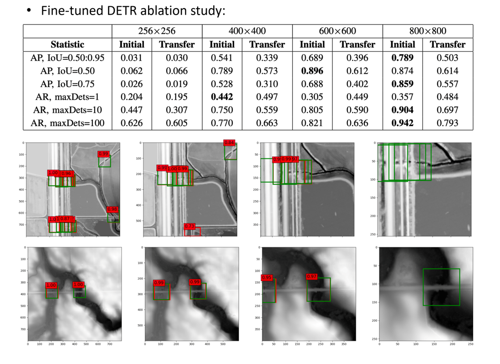
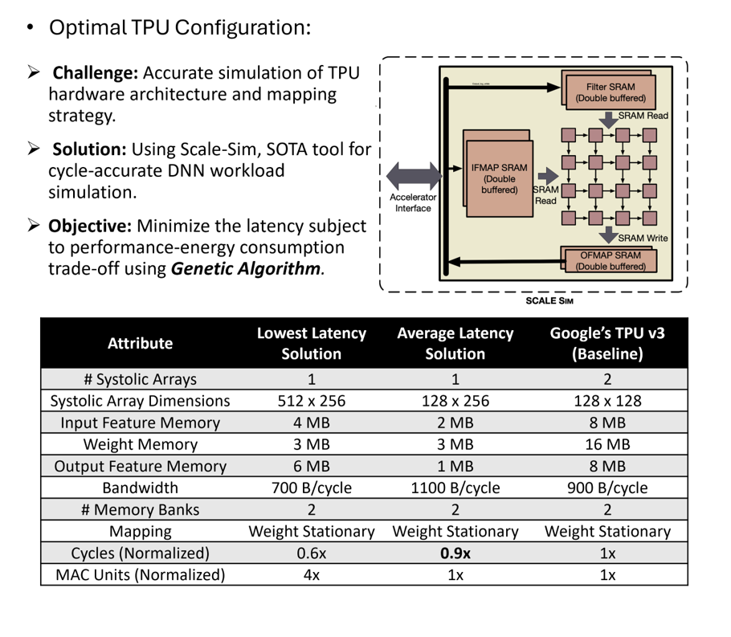

- Understanding hydrologic connectivity within landscapes is crucial for managing environmental challenges. Despite advancements in high-resolution Digital Elevation Models (DEMs) derived from Light Detection and Ranging (LiDAR) technology, accurately delineating hydrologic connectivity remains challenging due to disruptions caused by virtual flow barriers, such as roads and bridges. This study addresses this issue by enhancing the detection performance and reducing the latency of Transformer models for image detection of drainage crossings. We retrained a Detection Transformer (DETR) with a specialized recipe to improve culvert detection performance. Owing to the high susceptibility of LiDAR-based DEMs to measurement noise and varying data modalities, we conducted extensive data preprocessing to ensure DETR compatibility with the culvert dataset. Ablation studies on input size indicate that the model performs optimally with 800×800 pixel inputs, demonstrating its adaptability to new data modalities. Additionally, we employed Tensor Processing Units (TPUs) to decrease the model’s latency. We developed a novel strategy to optimize TPU architecture, utilizing genetic algorithms to expedite the discovery of optimal TPU configurations for detection deployment. Our model surpasses the performance of previous models on the same task. This work not only addresses the computational complexities of deploying advanced object detection in environmental contexts but also significantly contributes to the precise and efficient monitoring of hydrologic connectivity.

[More information here](https://ieeexplore.ieee.org/abstract/document/10826077)

