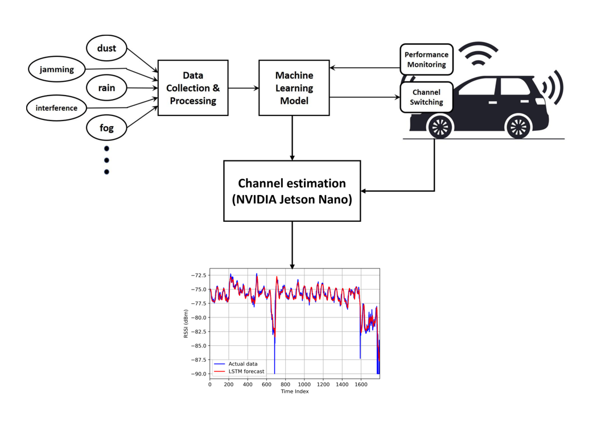

- With the development of 5G networks and advanced communication technologies, connected vehicles (CV) are becoming an increasingly important aspect of the future of transportation. The connected vehicles will usually generate a large amount of data that require fast and reliable communication channels with low latency. 5G millimeter-wave (mmWave) is crucial for the next generation of vehicle-to-vehicle (V2V) communications in CV scenarios. However, harsh weather conditions such as rain, snow, dust, and sand can significantly impact the performance of 5G mmWave channels for V2V communications. Maintaining seamless connections for connected vehicles during harsh weather conditions is a significant challenge that researchers must address. In this paper, we propose a two-stage strategy enabling connected vehicles to operate effectively under moderate and severe weather conditions. Our proposed approach involves a prediction step, which uses machine learning techniques to forecast weather patterns and determine the optimal communication strategy, followed by a switching step, which seamlessly chooses between frequency or channel switch based on the prediction. By incorporating these two steps, we aim to provide a robust and efficient communication system that can adapt to different weather conditions. The NS3 simulation results show that our switching strategy is effective and can benefit the field of connected vehicle technology.

[More information here](https://ieeexplore.ieee.org/abstract/document/10121804)

